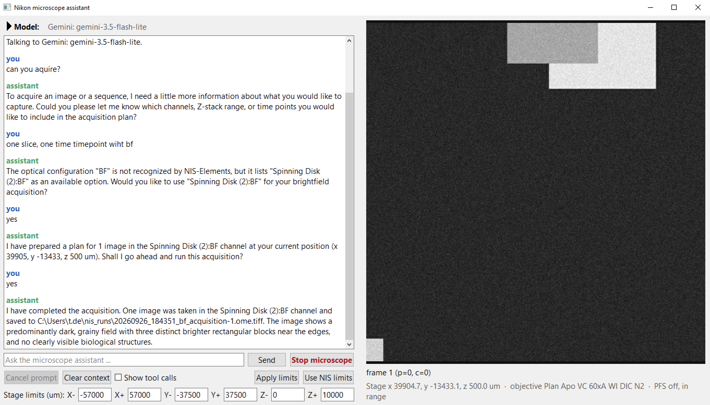

# nis-useq-aiagent

This repository consists of three things:

1. **nis-bridge:** control NIS-Elements from your own Python. → [README](1_nis_bridge/README.md)
2. **nis-engine:** run [useq](https://github.com/pymmcore-plus/useq-schema) acquisitions on a Nikon microscope. → [README](2_nis_engine/README.md)
3. **nis-assistant:** talk to your microscope through an AI agent. → [README](3_nis_assistant/README.md)



*The assistant on a Ti2 (NIS-Elements 6.10, Gemini as the model): it asks
which channel, shows the plan, runs it as a useq sequence, and describes the
image it took.*

useq-schema is the community's shared way to describe an acquisition
(positions, channels, Z-stacks, time points), so the same plan can come from
other useq tools.

There are three parts. Each is its own Python package with its own README and
tests, so you can adopt only the part you need:

| Part | Package | What it does | Needs |
|---|---|---|---|
| [1_nis_bridge](1_nis_bridge/README.md) | `nis-bridge` | Controls NIS-Elements from your own Python: a small server inside NIS and a client. No useq. | NIS-Elements |
| [2_nis_engine](2_nis_engine/README.md) | `nis-engine` | `NisEngine` runs useq sequences (classic and v2) on the microscope, through the pymmcore-plus runner. | part 1 |
| [3_nis_assistant](3_nis_assistant/README.md) | `nis-assistant` | A chat window whose assistant drives the microscope through useq and explains it, remembers the images it has seen, and carries out instructions on a schedule; Gemini, OpenAI, or a model on this computer. | parts 1 and 2 |

```
nis-assistant ──> nis-engine (NisEngine) ──> nis-bridge (client ── bridge in NIS) ──> microscope
```

Positions are NIS stage coordinates in micrometres (um); nothing here converts
coordinate systems.

## Before you start

You need, on the microscope computer:

1. NIS-Elements (the microscope, or its simulated Ti2 for trying things out).
2. Python 3.10 or newer, installed separately from the Python inside
   NIS-Elements, preferably in its own environment
   (`python -m venv nis-env`, then `nis-env\Scripts\activate`).
3. This repository: `git clone https://github.com/thomdehoog/nis-useq-aiagent`.
   Open a command window in it; every command below runs from there.

## Install

Install the parts you need, in this order (a later part needs the earlier
ones; installing part 2 first fails with "No matching distribution found for
nis-bridge"):

```
pip install -e "./1_nis_bridge[test]"
pip install -e "./2_nis_engine[test]"
pip install -e "./3_nis_assistant[test]"
```

`[test]` adds what the tests below need. Then one command starts NIS-Elements
with the bridge and opens the chat window:

```
nis-assistant --start-nis
```

Or start the bridge in NIS-Elements by hand, as part 1's README describes. Your
first result is one of these: a position read and an image snapped from Python
(part 1, "Use it"), a Z-stack saved as OME-TIFF (part 2, "Run a sequence"), or
a conversation in the chat window (part 3).

## Try it without a microscope

Part 1 includes a fake NIS-Elements. Start it in one command window and leave
it running:

```
python -m nis_bridge.fake
```

It answers on the bridge's usual port, so everything in the three READMEs
works against it: the examples, the hardware tests, and the chat window. Stop
it with Ctrl+C.

## Testing on NIS-Elements

With NIS-Elements running and `start_bridge.mac` started, test the parts in
order, and stop at the first step that fails, since each builds on the one
before. Always name the part's folder, as shown. Everything stays within 100
um of where the stage is, and the stage is moved back afterwards; still, keep
the objective clear of the sample for the first run.

```
pytest -m hardware -s 1_nis_bridge      # 1. read, move a little, configuration and exposure, snap
pytest -m hardware -s 2_nis_engine      # 2. camera field, limit check, useq v2 and classic, tiles, channel options, a sequence file
pytest -m hardware -s 3_nis_assistant   # 3. the assistant's tools, with a scripted model (no API calls)
```

`-s` prints what NIS reported and where the images were saved. Tests that need
a pixel calibration for the objective in use (the camera field, tiles) are
skipped without one, and say so. In step 2, a yellow pymmcore-plus warning
about `do_stack=False` is expected; the test checks the saved images itself.

Then try the assistant with the real model (`nis-assistant`; choose the model
and type its key in the Model panel at the top), in this order, and check each
answer against NIS. NIS needs at least one optical configuration (Calibration
> New Optical Configuration); without one, the assistant walks you through
adding it:

1. *Where is the stage, and which objective is in use?* (reads only)
2. *Move x by 20 um.* (moves at once) and *Move x by 5 mm.* (asks first; answer *no*)
3. *Move z to 20000 um.* (refused: red banner, nothing moves)
4. *Switch to* a configuration NIS has, *at 50 ms.*
5. *What do you see?* (the image appears on the right)
6. *Take a Z-stack of 4 um in 2 um steps here in* a configuration. (shows the
   plan and asks; answer *yes*; the files appear in the output folder)
7. *Image a 2 by 2 grid of tiles around here.* (needs a pixel calibration)
8. *Show me the useq sequence for that plan*, *What is new in useq v2?*, and
   *How does the engine move the stage? Show me the code.*
9. *Move the sample 100 um to the left.* (check on the screen that it went left; if
   not, change the Coordinate system box in the Model panel)
10. *Look again: has anything changed since the first image?* (the eyes compare with
    what they saw in step 5)
11. *Look every three minutes and tell me whether the sample drifts.* (a scheduled
    turn appears in the chat when it is due; *Stop microscope* cancels it)

To let a coding assistant on the microscope computer do all of this, give it this prompt:

```
In this repository, test the three parts on this NIS-Elements computer.
NIS-Elements is running and start_bridge.mac has been started (ask me if the
bridge does not answer). Work in three steps and stop at the first
failure, showing me the output and what you think went wrong; do not change
code without asking.
1. Run `pytest -m hardware -s 1_nis_bridge`.
2. Run `pytest -m hardware -s 2_nis_engine`, and tell me the shapes of the
   images it saved (it prints them).
3. Run `pytest -m hardware -s 3_nis_assistant`. Then start the window with
   `nis-assistant` and tell me, one at a time, the prompts from the checklist
   under "Testing on NIS-Elements" in README.md, and what to look for after
   each.
Finish with a short report: what passed, what was skipped and why, and
anything that looked wrong.
```

## Status

Validated on 2026-09-26 on NIS-Elements AR 6.10.02 with the Ti2 simulator:
all hardware tests of the three parts, and the assistant with Gemini. The code
was then reorganised into smaller files (2026-09-27), without changing what it
does, and re-tested on the fake NIS only; the next run on NIS-Elements will
confirm it there. Not yet run on a live Ti2 with a sample. Two things only a real turret can settle: how
an empty nosepiece slot is reported, and whether a failing `Capture` returns a
negative code.

MIT license. Thom de Hoog, Center for Microscopy and Image Analysis (ZMB),
University of Zurich. thom.dehoog@zmb.uzh.ch, thomdehoog@gmail.com. 2026-09-27.
